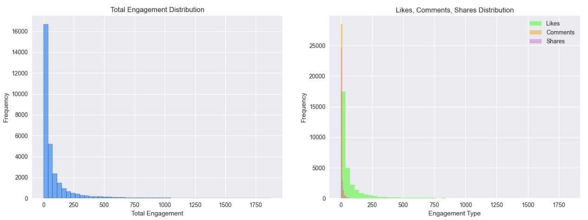
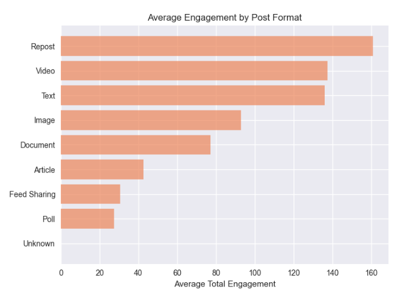
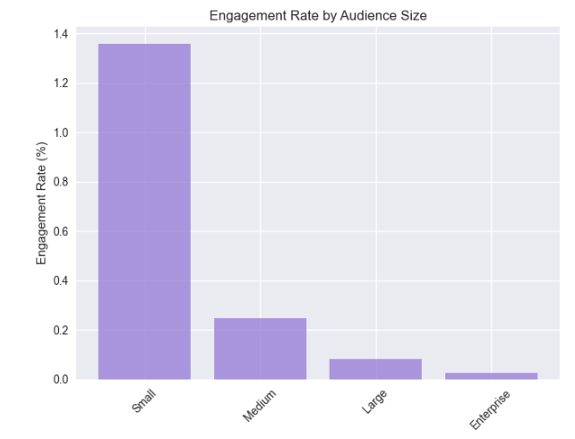
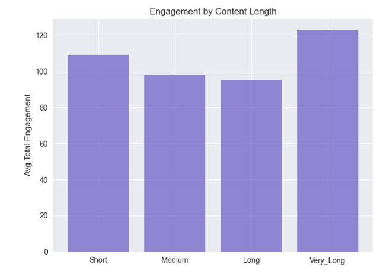
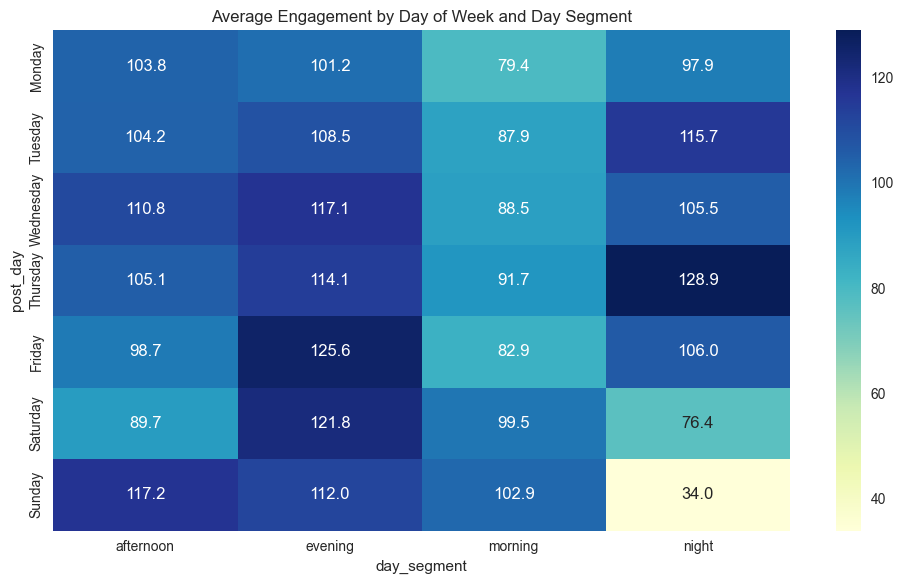
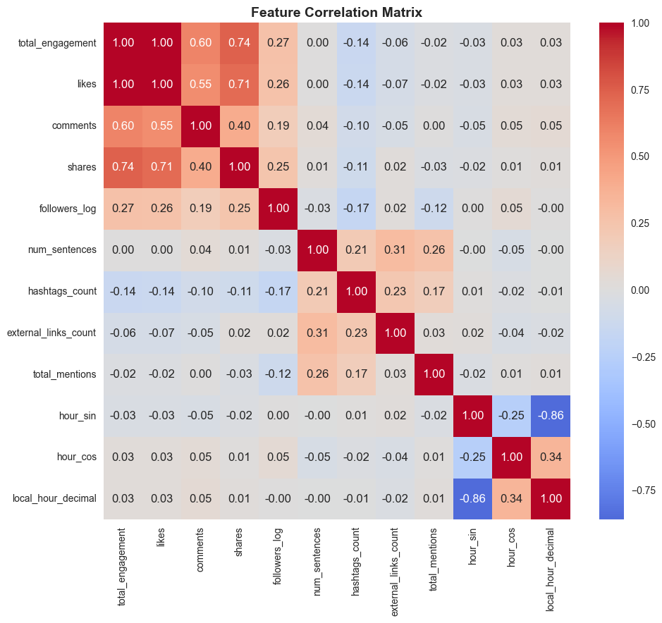
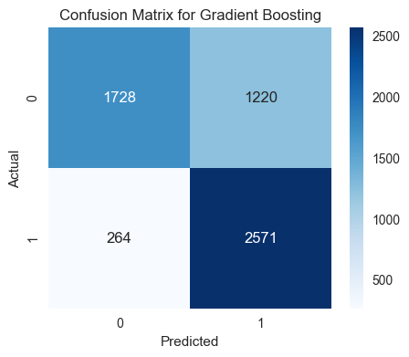
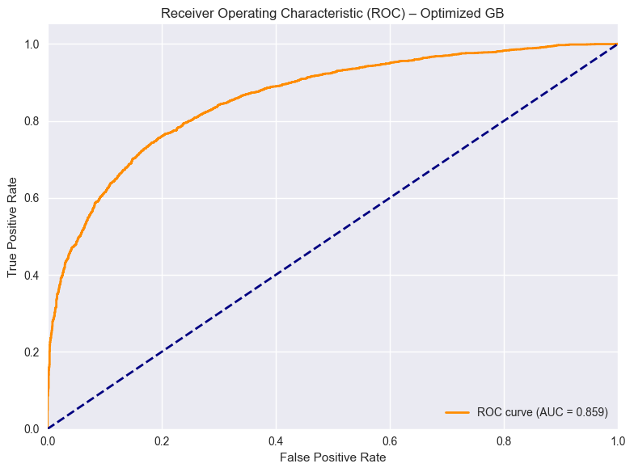
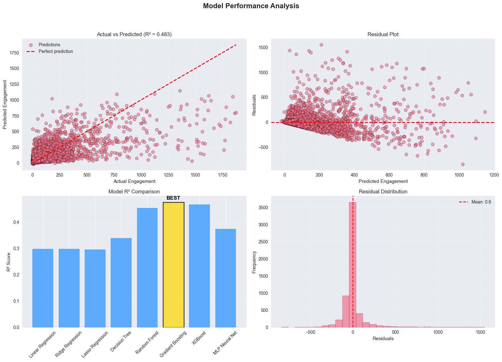
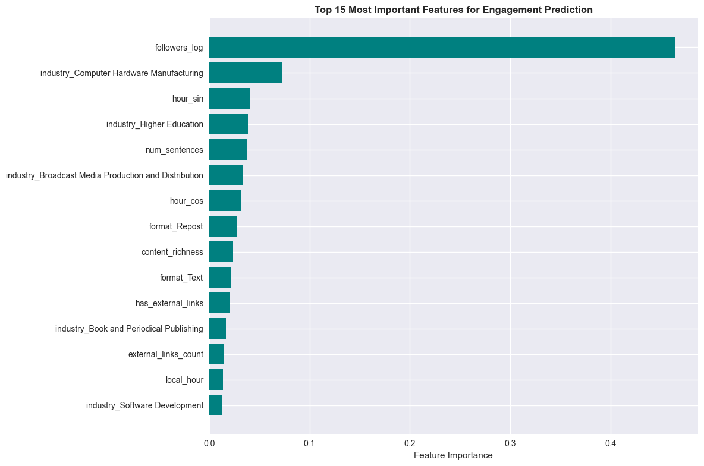

## LinkedIn Engagement Playbook — Data Science Project (FinDev)

Team: Paul Witczak, Filip Janeba, Jasmine Dressler, Sara Tamanza

### Contents
- [Executive summary](#executive-summary)
- [1) Business context](#1-business-context)
- [2) Data overview](#2-data-overview)
- [3) Preprocessing and feature engineering (what we did)](#3-preprocessing-and-feature-engineering-what-we-did)
- [4) Exploratory data analysis (what we found)](#4-exploratory-data-analysis-what-we-found)
- [5) Machine learning approach](#5-machine-learning-approach)
- [6) Model optimization and diagnostics](#6-model-optimization-and-diagnostics)
- [7) Interpreting the model — feature importance](#7-interpreting-the-model--feature-importance)
- [8) Business recommendations (playbook)](#8-business-recommendations-playbook)
- [9) For FinDev specifically (≈20k followers; B2B financial software)](#9-for-findev-specifically-20k-followers-b2b-financial-software)
- [10) Limitations and risk considerations](#10-limitations-and-risk-considerations)
- [11) Next steps](#11-next-steps)
- [12) Reproducibility](#12-reproducibility)
- [13) Personalization and post‑editing additions (teacher recommendations)](#13-personalization-and-postediting-additions-teacher-recommendations)
- [Appendix — feature inventory (selected)](#appendix--feature-inventory-selected)

### Executive summary
- **Goal**: Turn LinkedIn into a repeatable demand-gen channel by finding controllable levers that lift engagement.
- **Data**: 31,020 historical posts with content, timing, context, and engagement metrics across industries and geographies.
- **Method**: Clean and enrich data; EDA; end-to-end ML pipeline (scaling + one-hot encoding); compare 8 models; optimize the best; interpret with feature importance; derive a practical posting playbook.
- **Best model**: Gradient Boosting Regressor (R² ≈ 0.476 on holdout; optimized R² ≈ 0.483; ROC AUC ≈ 0.859 for high-vs-low engagement classification).
- **What moves the needle**: Follower base size dominates; post timing matters (evening > night > afternoon > morning); formats perform differently (Reposts, Video, Text > Image > Article/Poll); hashtags, external links, and @mentions tend to reduce engagement.
- **Actionable highlights**:
  - Best day segment: **Evening** (avg engagement ≈ 114.4)
  - Top time windows observed include: Saturday ~10.8, Sunday ~16.6, Tuesday ~4.8 (local-hour dec.)
  - Top format: **Repost** (avg ≈ 160.8); then **Video** (≈ 137.4), **Text** (≈ 136.0)

---

### 1) Business context
We are FinDev’s data science partner. FinDev builds financial software for B2B clients and wants to turn LinkedIn into a steady pipeline for awareness and qualified conversations.

The current performance is volatile: a few posts achieve strong visibility and engagement, while the majority receive minimal traction. This inconsistency limits the platform’s value as a predictable lead-generation and brand-building tool.

To address this, we aim to build a data-driven LinkedIn playbook that defines:
- **What to post**: which themes, tones, and content types resonate most
- **When to post**: optimal timing
- **How to post**: which formats deliver the best return

The ultimate goal is to move from ad-hoc content success to consistent, repeatable engagement growth.

- **Success metrics**:
  - **Primary**: Total engagement = Likes + Comments + Shares
  - **Secondary**: Engagement rate = Total Engagement / Total Followers
  - These reflect absolute performance and efficiency relative to audience size.

The mandate is to identify controllable levers—factors within FinDev’s influence that drive engagement—and quantify their impact. Specifically:
- **Timing**: posting day and hour
- **Format**: post type and media used
- **Content**: topic, tone, and message framing

By understanding which levers matter most, FinDev can systematize LinkedIn success and make performance a predictable outcome of strategic choices, not chance.

---

### 2) Data overview
- **Dataset composition**: 31,020 LinkedIn posts, 19 raw features (plus engineered variables added during preprocessing)
- **Time coverage**: 2013-10-31 to 2025-10-01 (12 years), enabling both long-term trend and short-term dynamics analysis
- **Data quality**:
  - Completeness: no missing values across the raw feature set
  - Uniqueness: no duplicate records in the raw snapshot
  - Therefore, the dataset was considered clean and reliable prior to feature engineering and modeling
- **Core raw features** (three dimensions):
  - Post metadata: `format`, `post_date`, `post_day`, `post_hour`
  - Engagement metrics: `likes`, `comments`, `shares`
  - Audience context: `followers`, `industry`, `location`
  - Content indicators: `hashtags_count`, `external_links_count`, `company_mentions_count`, `profile_mentions_count`

---

### 3) Preprocessing and feature engineering (what we did)
- Standardized timestamps and reconciled **local posting hour** using location-based offsets; created `local_hour_decimal` and `local_hour`.
- Built **time-of-day segment** (`day_segment`: morning/afternoon/evening/night) and **day-of-week cyclic encodings** (`day_sin`, `day_cos`). Added **hour cyclic encodings** (`hour_sin`, `hour_cos`).
- Computed engagement metrics: `total_engagement`, `engagement_rate`, `comments_ratio`.
- Segmentized audience size via followers: `Small`, `Medium`, `Large`, `Enterprise`.
- Content signals: `has_hashtags`, `has_external_links`, `has_mentions`, `total_mentions`, and a composite `content_richness`.
- Log-transformed followers to reduce skew: `followers_log = log1p(followers)`.
- Removed extreme viral outliers (top 1% by engagement) to stabilize modeling.
- Result: 25 engineered features; processed dataset size: 30,709 posts; ML-ready after NaN filtering: 28,914 posts. (We remove the NaN because it came from Followers being 0, it may come from scrapping error.)

---

### 4) Exploratory data analysis (what we found)
- The explanatory data analysis focused on understanding engagement behaviour patterns across timing, content format, audience scale, and other contextual factors. Distributions, correlations, and segmentation analyses were performed to reveal the underlying drivers of variability in LinkedIn post performance.
- **Distribution patterns** 
  - Across all engagement metrics, the data exhibited heavy-tailed distribution - meaning a small minority of posts captured a disproportionately large share of total engagement

- **Format differences** in mean engagement (descending):
  - Repost ≈ 160.8
  - Video ≈ 137.4
  - Text ≈ 136.0
  - Image ≈ 93.0
  - Document ≈ 77.1
  - Article ≈ 42.6
  - Poll ≈ 27.5
  

  
- **Audience size**: Larger audiences show higher absolute engagement but not necessarily higher engagement rate.

- **Content length**: Larger audiences might show higher absolute engagement but this graph reveals that small audiences have significantly higher engagement rate.
This is a common phenomenon in social media and marketing analytics: smaller audiences often have more loyal or niche followers, leading to higher interaction relative to their size, while larger or enterprise accounts typically have more followers but less engaged.

- **Timing**: Evening performs best; then night, afternoon, morning. Hourly patterns reveal elevated engagement around late morning/afternoon/evening on weekends.

- **Correlation highlights**: Except `likes, comments and shares` that are summed to get the `total_engagement`, `followers_log` has the strongest positive correlation with `total_engagement`. 

The exploratory analysis underscores that engagement is shaped by both structural factors (follower base, format) and behavioral timing (evenings, weekends). Content quality indicators such as length and richness show measurable lift, while excessive external linking or tagging correlates with reduced reach. These insights informed the subsequent feature modeling and playbook design.

---

### 5) Machine learning approach
- **Objective**
  - Regression: predict `total_engagement` as a continuous target
  - Classification: evaluate high vs low engagement via median-thresholded predictions
- **Train/test split**: 80/20 with stratification on `audience_size_category`.
- **Pipeline**:
  - Numerical: `StandardScaler`
  - Categorical: `OneHotEncoder(drop='first')`
  - Final design matrix: 89 transformed features.
- **Models compared** (default-ish configs):
  - Linear, Ridge, Lasso
  - Decision Tree, Random Forest
  - Gradient Boosting, XGBoost
  - MLPRegressor
- **Key metrics**:
  - Regression: Test R², RMSE, MAE; CV R² (3-fold) for consistency
  - Classification: ROC AUC, F1, Cohen’s Kappa, Confusion Matrix

#### Headline results (holdout test)
**📊 MODEL PERFORMANCE COMPARISON (Regression + Binary Classification)**

| Model | Test R² | Test RMSE | Test MAE | Test ROC AUC | Test F1 | Test Kappa | CV R² Mean |
|---|---|---|---|---|---|---|---|
| Gradient Boosting | **0.47594** | 149.977527 | 69.198876 | 0.866812 | 0.776034 | 0.489872 | 0.46057 |
| XGBoost | 0.467574 | 151.169793 | 69.652141 | 0.863389 | 0.781531 | 0.514749 | 0.447115 |
| Random Forest | 0.454673 | 152.990315 | 71.876508 | 0.856696 | 0.774135 | 0.488367 | 0.447999 |
| MLP Neural Net | 0.375153 | 163.765563 | 81.854639 | 0.796491 | 0.731317 | 0.421376 | 0.379815 |
| Decision Tree | 0.339801 | 168.334466 | 74.855297 | 0.844229 | 0.753173 | 0.432049 | 0.313219 |
| Linear Regression | 0.298359 | 173.537384 | 89.914642 | 0.797720 | 0.726805 | 0.344715 | 0.296786 |
| Ridge Regression | 0.298292 | 173.545634 | 89.861060 | 0.797544 | 0.726571 | 0.343708 | 0.296864 |
| Lasso Regression | 0.295922 | 173.838532 | 89.594582 | 0.792356 | 0.724187 | 0.331677 | 0.295490 |

Ensemble methods (Gradient Boosting, XGBoost, Random Forest) clearly outperformed linear and neural baselines, achieving near-identical and stable generalization performance.
More specifically Gradient Boosting has the highest R² and lowest errors (RMSE and MAE)

#### Confusion matrix (Gradient Boosting; high vs low engagement)

- Precision ≈ 0.678; Recall ≈ 0.907; Accuracy ≈ 0.743

---

### 6) Model optimization and diagnostics
- **Tuning**: GridSearchCV on Gradient Boosting with ranges for `n_estimators`, `max_depth`, `learning_rate`, `subsample`, `min_samples_split`, `min_samples_leaf`.
- **Best params**: `{learning_rate: 0.05, max_depth: 5, min_samples_leaf: 2, min_samples_split: 5, n_estimators: 200, subsample: 0.8}`
- **Optimized performance**:
  - R² ≈ 0.4833; RMSE ≈ 148.92; MAE ≈ 69.48
  - Binary classification: ROC AUC ≈ 0.859; F1 ≈ 0.764; Kappa ≈ 0.454

- **Diagnostics**: Actual-vs-Predicted scatter shows reasonable fit with spread expected for social data; residuals centered around 0; model comparison confirms ensemble superiority.

---

### 7) Interpreting the model — feature importance
Top drivers (optimized Gradient Boosting, top-10):
1) `followers_log` (≈ 0.464)
2) `industry_Computer Hardware Manufacturing` (≈ 0.072)
3) `hour_sin` (≈ 0.040)
4) `industry_Higher Education` (≈ 0.038)
5) `num_sentences` (≈ 0.038)
6) `industry_Broadcast Media Production and Distribution` (≈ 0.034)
7) `hour_cos` (≈ 0.032)
8) `format_Repost` (≈ 0.028)
9) `content_richness` (≈ 0.024)
10) `format_Text` (≈ 0.022)

Interpretation:
- Building and nurturing the follower base is the single most impactful lever.
- Timing matters in a cyclical way (captured by sine/cosine encodings).
- Long-form content (more sentences) and richer content correlate with higher engagement.
- Industry and format context materially influence outcomes.

---

### 8) Business recommendations (playbook)

#### Optimal posting times (illustrative top-10 hours by day)
- Saturday at 10.78 (local-hour dec.) — avg ≈ 1823
- Sunday at 16.55 — avg ≈ 1793
- Tuesday at 4.77 — avg ≈ 1782
- Saturday at 21.15 — avg ≈ 1656
- Sunday at 19.23 — avg ≈ 1644
- Sunday at 11.83 — avg ≈ 1616
- Thursday at 2.37 — avg ≈ 1591
- Friday at 22.58 — avg ≈ 1590
- Monday at 2.90 — avg ≈ 1524
- Saturday at 20.17 — avg ≈ 1513

#### Best day segments
- Evening (≈ 114.4) > Night (≈ 107.0) > Afternoon (≈ 104.6) > Morning (≈ 87.5)

#### Format strategy (avg engagement)
- Repost (≈ 160.8) > Video (≈ 137.4) > Text (≈ 136.0) > Image (≈ 93.0) > Document (≈ 77.1) > Article (≈ 42.6) > Poll (≈ 27.5)

#### Content element guidance
- Posts with hashtags perform −38.8% vs without hashtags
- Posts with external links perform −22.1% vs without links
- Posts with mentions perform −15.6% vs without mentions
Note: These are correlational reductions in this dataset; treat as guardrails, not absolutes. When using links/mentions, ensure strong creative and relevance.

#### Audience-specific recommendations (examples by segment)
- Medium audience: Repost; Sunday; ~21.15; best segment often afternoon/evening
- Large audience: Repost; Wednesday; ~21.48; morning segment strong
- Small audience: Repost; Saturday; ~21.38; night segment strong
- Enterprise: Text; Wednesday; ~7.95; evening segment strong
Note: All times are in decimal format.

#### Industry benchmarking (top-5 by avg engagement)
- Computer Hardware Manufacturing, Spectator Sports, Higher Education, Law Enforcement, Technology/Internet

---

### 9) For FinDev specifically (≈20k followers; B2B financial software)
- Prioritize **Reposts** and **Videos** for reach; test compelling **Text** posts (thought leadership, narrative + CTA).
- Target **Evening** and late **Afternoon** windows; emphasize **weekends** (Saturday/Sunday) per the observed peaks.
- Minimize hashtags, external links, and gratuitous mentions in high-priority posts; use them only when they add clear value.
- Invest in follower growth: cross-promotion, employee advocacy, gated content strategy.
- Creative checklist: narrative clarity, concrete visual support (for Video/Image), specific POV, and one clear CTA.

**Expected impact**: Transition from inconsistent engagement to an average of ~160+ interactions per priority post, with improved predictability through optimized timing and content alignment.

---

### 10) Limitations and risk considerations
- Observational data: correlations ≠ causation; confounding factors (e.g., creative quality) are imperfectly captured.
- Temporal drift: platform behavior changes; retraining and recalibration needed.
- **Time zone caveat**: For large countries, we approximated by a single time zone.
- Industry heterogeneity: engagement norms vary; recommendations should be contextualized.
- Metric focus: engagement volume may not directly translate to revenue lift.

---

### 11) Next steps
- Conduct controlled A/B tests to validate causal impacts of timing and content format.
- Incorporate text embeddings or LLM-based topic/tone models for semantic analysis.
- Build per-industry fine-tuning and multi-objective optimization (engagement + CTR/lead quality).
- Automate weekly retraining and drift monitoring with performance alerts.

---

### 12) Reproducibility
- Notebook: `Linkedin_Final_Project.ipynb`
- Data: `./data/linkedin.csv` (semicolon-separated)
- Environment: Python; scikit-learn, xgboost, seaborn, matplotlib, pandas, numpy
- Pipeline summary: 16 numerical (scaled) + 7 categorical (one-hot, drop-first) → 89 features; 80/20 split; median threshold for classification analysis.

# /!\ Need Review

### 13) Personalization and post‑editing additions (teacher recommendations)

#### Segmentation and personalization (K‑Means)
- Goal: tailor recommendations by audience and post clusters.
- Method: K‑Means clustering with elbow method to select k; PCA for 2D visualization; profiling per cluster.
- User clustering (k ≈ 4):
  - Features: `followers_log` (scaled), `location`, `industry`, `audience_size_category` (one‑hot encoded)
  - Output: distinct audience tiers (Small, Medium, Large, Enterprise) captured by clusters; use clusters to adapt posting windows and formats.
- Post clustering (k ≈ 5):
  - Features: `format`, `content_length_category` (encoded), plus numeric signals `num_sentences`, `hashtags_count`, `external_links_count`, `total_mentions`, `content_richness`, `is_weekend`, `is_business_hours`
  - Profiles (example signals): content richness, length, link/hashtag density, working‑hours vs weekend share.
  - Typical posts: for each cluster, extract the closest post to the centroid to serve as a concrete content template.

How to use in the playbook:
- Map a brand to a user cluster → apply cluster‑specific timing and format guidance.
- Map a draft to a post cluster → use the cluster’s “typical post” as a template; adjust richness/length/links accordingly.

#### Industry alignment recommender
- Provide top industry probabilities for a draft post to inform targeting and message framing before publishing.
- Use alongside audience and post clusters to ensure format/timing/positioning are aligned with the most likely industry audience.

Note: Time zone approximation was applied for large countries (single zone); see Limitations.

---

### Appendix — feature inventory (selected)
- Time: `local_hour`, `local_hour_decimal`, `day_segment`, `hour_sin`, `hour_cos`, `day_sin`, `day_cos`
- Content: `num_sentences`, `content_length_category`, `hashtags_count`, `external_links_count`, `total_mentions`, `has_*`, `content_richness`
- Audience/context: `followers_log`, `audience_size_category`, `industry`, `location`, `format`, `post_day`
- Targets/metrics: `total_engagement`, `engagement_rate`, `comments_ratio`

---