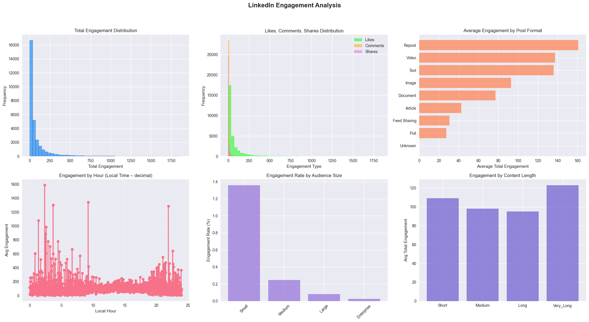

## LinkedIn Engagement Playbook — Data Science Project (FinDev)

Team: Paul Witczak, Filip Janeba, Jasmine Dressler, Sara Tamanza

### Executive summary
- **Goal**: Turn LinkedIn into a repeatable demand-gen channel by finding controllable levers that lift engagement.
- **Data**: 31,020 historical posts with content, timing, context, and engagement metrics across industries and geographies.
- **Method**: Clean and enrich data; EDA; end-to-end ML pipeline (scaling + one-hot encoding); compare 8 models; optimize the best; interpret with feature importance; derive a practical posting playbook.
- **Best model**: Gradient Boosting Regressor (R² ≈ 0.476 on holdout; optimized R² ≈ 0.483; ROC AUC ≈ 0.859 for high-vs-low engagement classification).
- **What moves the needle**: Follower base size dominates; post timing matters (evening > night > afternoon > morning); formats perform differently (Reposts, Video, Text > Image > Article/Poll); hashtags, external links, and @mentions tend to reduce engagement.
- **Actionable highlights**:
  - Best day segment: **Evening** (avg engagement ≈ 114.4)
  - Top time windows observed include: Saturday ~10.8, Sunday ~16.6, Tuesday ~4.8 (local-hour dec.)
  - Top format: **Repost** (avg ≈ 160.8); then **Video** (≈ 137.4), **Text** (≈ 136.0)

---

### 1) Business context
FinDev (B2B financial software) needs reliable reach to buyers on LinkedIn. Current performance is volatile: a few standout posts, many quiet ones. We aim to build a data-backed playbook—what to post, and when—to lift engagement consistently.

- **Success metric**: Total engagement = Likes + Comments + Shares
- **Mandate**: Identify controllable levers (timing, format, content) and quantify their impact.

---

### 2) Data overview
- **Rows**: 31,020 posts; **Columns**: 19 raw features (plus engineered features)
- **Time range**: 2013-10-31 to 2025-10-01
- **Completeness**: 0 missing; 0 duplicates in raw snapshot
- **Key raw fields**: `format`, `post_date`, `post_day`, `post_hour`, `likes`, `comments`, `shares`, `followers`, `industry`, `location`, content counters (hashtags, links, mentions)

---

### 3) Preprocessing and feature engineering (what we did)
- Standardized timestamps and reconciled **local posting hour** using location-based offsets; created `local_hour_decimal` and `local_hour`.
- Built **time-of-day segment** (`day_segment`: morning/afternoon/evening/night) and **day-of-week cyclic encodings** (`day_sin`, `day_cos`). Added **hour cyclic encodings** (`hour_sin`, `hour_cos`).
- Computed engagement metrics: `total_engagement`, `engagement_rate`, `comments_ratio`.
- Segmentized audience size via followers: `Small`, `Medium`, `Large`, `Enterprise`.
- Content signals: `has_hashtags`, `has_external_links`, `has_mentions`, `total_mentions`, and a composite `content_richness`.
- Log-transformed followers to reduce skew: `followers_log = log1p(followers)`.
- Removed extreme viral outliers (top 1% by engagement) to stabilize modeling.
- Result: 25 engineered features; processed dataset size: 30,709 posts; ML-ready after NaN filtering: 28,914 posts. (We remove the NaN because it came from Followers being 0, it may come from scrapping error.)

---

### 4) Exploratory data analysis (what we found)
- Distributions are heavy-tailed; a minority of posts drive a large share of engagement.
- **Format differences** in mean engagement (descending):
  - Repost ≈ 160.8
  - Video ≈ 137.4
  - Text ≈ 136.0
  - Image ≈ 93.0
  - Document ≈ 77.1
  - Article ≈ 42.6
  - Poll ≈ 27.5
- **Audience size**: Larger audiences show higher absolute engagement but not necessarily higher engagement rate.
- **Content length**: Moderate-to-long content correlates with higher engagement vs very short.

- **Timing**: Evening performs best; then night, afternoon, morning. Hourly patterns reveal elevated engagement around late morning/afternoon/evening on weekends.

- **Correlation highlights**: Except `likes, comments and shares` that are summed to get the `total_engagement`, `followers_log` has the strongest positive correlation with `total_engagement`.

---

### 5) Machine learning approach
- **Target**: `total_engagement` (regression). Additionally, we evaluate classification performance on a derived label (above/below median engagement) for decision support.
- **Train/test split**: 80/20 with stratification on `audience_size_category`.
- **Pipeline**:
  - Numerical: `StandardScaler`
  - Categorical: `OneHotEncoder(drop='first')`
  - Final design matrix: 89 transformed features.
- **Models compared** (default-ish configs):
  - Linear, Ridge, Lasso
  - Decision Tree, Random Forest
  - Gradient Boosting, XGBoost
  - MLPRegressor
- **Key metrics**:
  - Regression: Test R², RMSE, MAE; CV R² (3-fold) for consistency
  - Classification (using median threshold on predictions): ROC AUC, F1, Cohen’s Kappa, Confusion Matrix

#### Headline results (holdout test)
- Gradient Boosting: **R² 0.476**, RMSE ≈ 149.98, MAE ≈ 69.20, ROC AUC ≈ 0.867, F1 ≈ 0.776, Kappa ≈ 0.490, CV R² ≈ 0.461
- XGBoost: R² 0.468, RMSE ≈ 151.17, MAE ≈ 69.65, ROC AUC ≈ 0.863, F1 ≈ 0.782, Kappa ≈ 0.515, CV R² ≈ 0.447
- Random Forest: R² 0.455, RMSE ≈ 152.99, MAE ≈ 71.88, ROC AUC ≈ 0.857, F1 ≈ 0.774, Kappa ≈ 0.488, CV R² ≈ 0.448
- MLP: R² 0.375, RMSE ≈ 163.77, MAE ≈ 81.85
- Linear/Ridge/Lasso and a standalone Tree trail the ensembles.

#### Confusion matrix (Gradient Boosting; high vs low engagement)

- Precision ≈ 0.678; Recall ≈ 0.907; Accuracy ≈ 0.743

---

### 6) Model optimization and diagnostics
- **Tuning**: GridSearchCV on Gradient Boosting with ranges for `n_estimators`, `max_depth`, `learning_rate`, `subsample`, `min_samples_split`, `min_samples_leaf`.
- **Best params**: `{learning_rate: 0.05, max_depth: 5, min_samples_leaf: 2, min_samples_split: 5, n_estimators: 200, subsample: 0.8}`
- **Optimized performance**:
  - R² ≈ 0.4833; RMSE ≈ 148.92; MAE ≈ 69.48
  - Binary classification: ROC AUC ≈ 0.859; F1 ≈ 0.764; Kappa ≈ 0.454

# /!\ I stopped here

- **Diagnostics**: Actual-vs-Predicted scatter shows reasonable fit with spread expected for social data; residuals centered around 0; model comparison confirms ensemble superiority.

---

### 7) Interpreting the model — feature importance
Top drivers (optimized Gradient Boosting, top-10):
1) `followers_log` (≈ 0.464)
2) `industry_Computer Hardware Manufacturing` (≈ 0.072)
3) `hour_sin` (≈ 0.040)
4) `industry_Higher Education` (≈ 0.038)
5) `num_sentences` (≈ 0.038)
6) `industry_Broadcast Media Production and Distribution` (≈ 0.034)
7) `hour_cos` (≈ 0.032)
8) `format_Repost` (≈ 0.028)
9) `content_richness` (≈ 0.024)
10) `format_Text` (≈ 0.022)

Interpretation:
- Building and nurturing the follower base is the single most impactful lever.
- Timing matters in a cyclical way (captured by sine/cosine encodings).
- Long-form content (more sentences) and richer content correlate with higher engagement.
- Format and industry context materially influence outcomes.

---

### 8) Business recommendations (playbook)

#### Optimal posting times (illustrative top-10 hours by day)
- Saturday at 10.78 (local-hour dec.) — avg ≈ 1823
- Sunday at 16.55 — avg ≈ 1793
- Tuesday at 4.77 — avg ≈ 1782
- Saturday at 21.15 — avg ≈ 1656
- Sunday at 19.23 — avg ≈ 1644
- Sunday at 11.83 — avg ≈ 1616
- Thursday at 2.37 — avg ≈ 1591
- Friday at 22.58 — avg ≈ 1590
- Monday at 2.90 — avg ≈ 1524
- Saturday at 20.17 — avg ≈ 1513

#### Best day segments
- Evening (≈ 114.4) > Night (≈ 107.0) > Afternoon (≈ 104.6) > Morning (≈ 87.5)

#### Format strategy (avg engagement)
- Repost (≈ 160.8) > Video (≈ 137.4) > Text (≈ 136.0) > Image (≈ 93.0) > Document (≈ 77.1) > Article (≈ 42.6) > Poll (≈ 27.5)

#### Content element guidance
- Hashtags: −38.8% vs posts without
- External links: −22.1%
- Mentions: −15.6%
Note: These are correlational reductions in this dataset; treat as guardrails, not absolutes. When using links/mentions, ensure strong creative and relevance.

#### Audience-specific recommendations (examples by segment)
- Medium audience: Repost; Sunday; ~21.15; best segment often afternoon/evening
- Large audience: Repost; Wednesday; ~21.48; morning segment strong
- Small audience: Repost; Saturday; ~21.38; night segment strong
- Enterprise: Text; Wednesday; ~7.95; evening segment strong

#### Industry benchmarking (top-5 by avg engagement)
- Computer Hardware Manufacturing, Spectator Sports, Higher Education, Law Enforcement, Technology/Internet

---

### 9) For FinDev specifically (≈20k followers; B2B financial software)
- Prioritize **Reposts** and **Videos** for reach; test compelling **Text** posts (thought leadership, narrative + CTA).
- Target **Evening** and late **Afternoon** windows; emphasize **weekends** (Saturday/Sunday) per the observed peaks.
- Minimize hashtags, external links, and gratuitous mentions in high-priority posts; use them only when they add clear value.
- Invest in follower growth: cross-promotion, employee advocacy, gated content strategy.
- Creative checklist: narrative clarity, concrete visual support (for Video/Image), specific POV, and one clear CTA.

Expected impact: Moving from mixed results toward ~160+ average engagement per high-priority post (reposts baseline), plus improved top-end outcomes through better timing/format alignment.

---

### 10) Limitations and risk considerations
- Observational data: correlations ≠ causation; confounding factors (e.g., creative quality) are imperfectly captured.
- Temporal drift: platform behavior changes; retraining and recalibration needed.
- Industry mix effects: audience expectations differ; tailor by segment/industry.
- Metric scope: engagement quantity; does not directly measure downstream revenue lift.

---

### 11) Next steps
- Controlled A/Bs on timing, formats, and content elements to validate causality and lift.
- Add text understanding (embeddings/LLMs) to capture topic and tone.
- Per-industry fine-tuning and multi-objective optimization (engagement + CTR/lead quality).
- Automate weekly retraining/monitoring; add drift and performance alerts.

---

### 12) Reproducibility
- Notebook: `Linkedin_Final_Project.ipynb`
- Data: `./data/linkedin.csv` (semicolon-separated)
- Environment: Python; scikit-learn, xgboost, seaborn, matplotlib, pandas, numpy
- Pipeline summary: 16 numerical (scaled) + 7 categorical (one-hot, drop-first) → 89 features; 80/20 split; median threshold for classification analysis.

---

### Appendix — feature inventory (selected)
- Time: `local_hour`, `local_hour_decimal`, `day_segment`, `hour_sin`, `hour_cos`, `day_sin`, `day_cos`
- Content: `num_sentences`, `content_length_category`, `hashtags_count`, `external_links_count`, `total_mentions`, `has_*`, `content_richness`
- Audience/context: `followers_log`, `audience_size_category`, `industry`, `location`, `format`, `post_day`
- Targets/metrics: `total_engagement`, `engagement_rate`, `comments_ratio`

This document is a text-first presentation of methods, findings, and the resulting LinkedIn posting playbook. Use it as a living artifact to guide experiments and updates as the platform and audience evolve.
